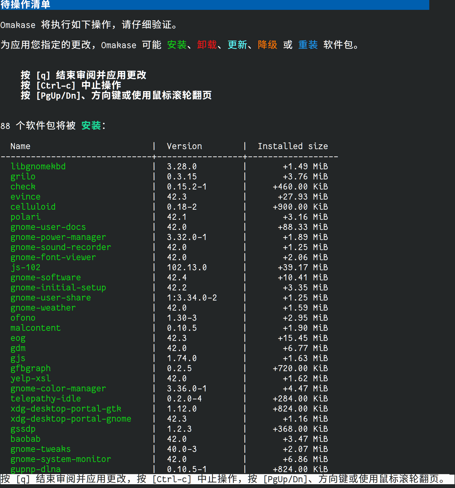

# oma

Oma (Omakase) ~~(Oh My Ailurus, 小熊猫包管理)~~ is a AOSC OS Package manager. A package manager implementation with `libapt-pkg` as a backend.

> Omakase お任せ (adj.): According to the chef's choice. — Marriam-Webster.

Although it is based on apt, we did quite a bit of extra work, the goal of this project is to make apt with better user interaction (especially for AOSC OS users), you can get a feel for the differences between oma and apt with the following examples:

### Pending Operations



### Multi-thread download

[][https://asciinema.org/a/596691]

### Smart Search

[][https://asciinema.org/a/610838]

### Undo

[][https://asciinema.org/a/610839]

...and more.

## Dependencies

- libapt-pkg 2.5.4
- Glibc
- Ripgrep binary (optional, `--no-default-features --features contents-without-rg` to disable)
- C Compiler
- OpenSSL
- Rustc with Cargo
- nettle

## Build & install

```bash
cargo build --release
cp ./target/release/oma /usr/local/bin/oma
```

## Usage

```bash
saki@Magputer [ aoscpt@master ] $ oma
Omakase (oma) - Package management interface for AOSC OS

Usage: oma [OPTIONS] [COMMAND]

Commands:
  install     Install package(s) from the repository
  upgrade     Upgrade packages installed on the system
  download    Download package(s) from the repository
  remove      Remove the specified package(s)
  refresh     Refresh repository metadata/catalog
  show        Show information on the specified package(s)
  search      Search for package(s) available from the repository
  files  List files in the specified package
  provides    Search for package(s) that provide(s) certain patterns in a path
  fix-broken  Resolve broken system dependencies in the system
  pick        Install specific version of a package
  mark        Mark status for one or multiple package(s)
  list        List package(s) available from the repository
  depends     Lists dependencies of one or multiple packages
  rdepends    List reverse dependency(ies) for the specified package(s)
  clean       Clear downloaded package cache
  history     Show a history/log of package changes in the system
  help        Print this message or the help of the given subcommand(s)

Options:
      --debug    Run oma with debug mode
  -h, --help     Print help (see more with '--help')
  -V, --version  Print version

```

